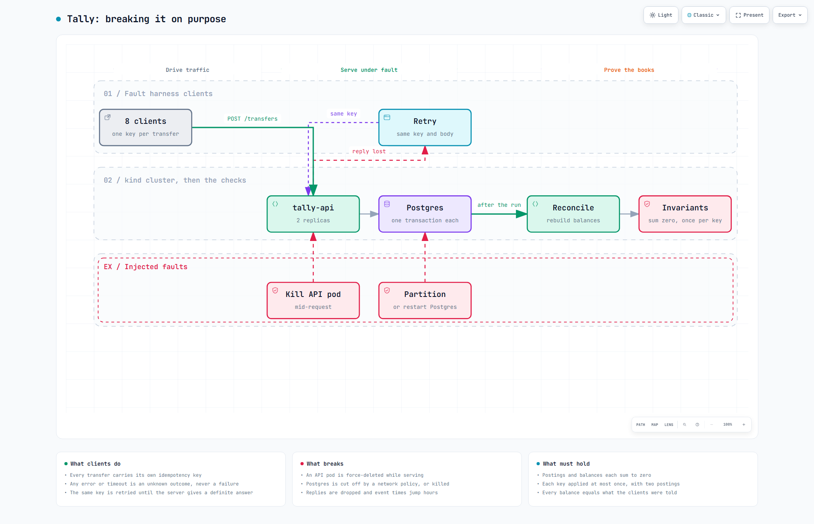
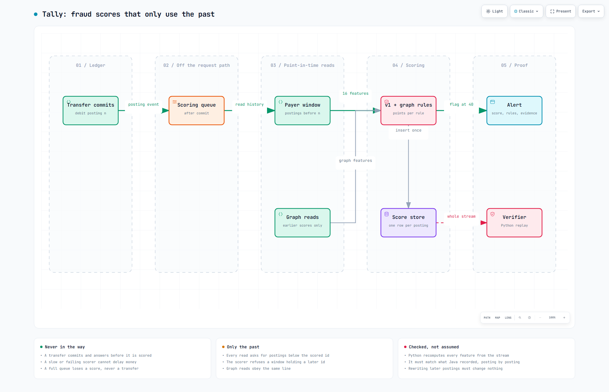
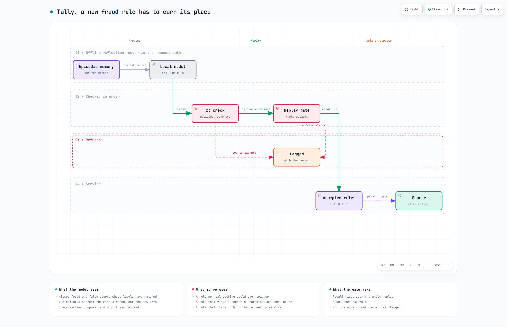

# Tally

Tally is a small bank that can never lose or double a cent. Every transfer is written as two entries that cancel out, a payment retried after a dropped connection lands exactly once, every balance can be rebuilt from scratch to prove nothing leaked, and suspicious transfers are flagged after they land with the evidence attached.

**Demo:** [samad-zeeshan.github.io/Tally](https://samad-zeeshan.github.io/Tally/) replays runs recorded from the real service: a transfer, a retry after a lost reply, a reconciliation, a fault injection, and a mule chain being flagged. A 90-second walkthrough is in [docs/media/demo.mp4](docs/media/demo.mp4).


## How it works

A Java service on the JDK's HTTP server writes each transfer to Postgres in one transaction, and a fraud scorer reads the committed postings afterwards, off the request path.

-  The parts of the service, and how the Postgres or in-memory store is chosen at startup.
-  A transfer is applied once, its reply is lost, and the retry with the same key gets the stored result back.
-  The ledger tables and the database constraints that back the code's rules.
-  What runs where, locally and on the kind cluster.
-  How the fault harness breaks the cluster while clients keep paying, and what it checks afterwards.
-  How each fraud score is built only from postings committed before it, and how that is verified.
-  How a rule proposed by a local model has to pass a z3 check and then a full replay before anyone can switch it on.

Each has an interactive version beside it in `docs/diagrams/`.

## Why it is correct

The ledger's rules are stated four ways. The TLA+ model in `spec/Ledger.tla` follows `JdbcStore.apply` statement by statement, with two workers, three clients whose transfers cross, crashes that roll a transaction back, lost requests and replies, and retries that race the first copy. Postgres enforces the same rules as constraints: a unique idempotency key, a balance check that only the world account may break, and non-zero postings. The fault harness then breaks a real cluster and compares Postgres with what every client was told. Reconciliation rebuilds every balance from its postings on demand.

<!-- gen:spec -->
| Model | Expected | Result | Distinct states | Invariant broken |
|---|---|---|---|---|
| the real protocol | pass | pass | 394,177 | none |
| idempotency check removed | violation | violation | 25,102 | ExactlyOnce |
<!-- /gen -->

The model covers the protocol, not the Java. It does not model the in-memory store, the connection pool, or several API replicas sharing one database, and money is a small integer rather than a `long`. The code and the model can agree on a misreading, which is the gap arXiv 2607.05076 warns about, and it is why the fault runs below exist as a second check.

<!-- gen:faults -->
| Fault | Transfers | Retries | Money created or lost | Applied twice | Phantom | Confirmed but missing | Reconciles | Longest wait for an answer |
|---|---|---|---|---|---|---|---|---|
| none | 1,958 | 0 | 0 | 0 | 0 | 0 | yes | 0.2 s |
| api pod kill | 2,123 | 25 | 0 | 0 | 0 | 0 | yes | 3.2 s |
| postgres restart | 1,185 | 155 | 0 | 0 | 0 | 0 | yes | 10.1 s |
| partition | 939 | 32 | 0 | 0 | 0 | 0 | yes | 15.2 s |
| clock skew | 2,082 | 0 | 0 | 0 | 0 | 0 | yes | 0.1 s |
| dropped responses | 1,742 | 698 | 0 | 0 | 0 | 0 | yes | 0.2 s |
| mixed | 1,025 | 670 | 0 | 0 | 0 | 0 | yes | 12.1 s |
<!-- /gen -->

<!-- gen:faults-summary -->
7 runs, 11,054 transfers and 1,580 retries, 0 violations of any kind.
<!-- /gen -->
Each run keeps sending until its faults have played out and every client has a definite answer, so a fault that no request noticed fails the run. The partition is a NetworkPolicy plus cutting the pool's open sockets from the database side. These runs used kind on Docker Desktop on one Windows laptop, and CI repeats them on every push as the fifth gate after the four deployment gates. The first runs found five real problems, each now fixed with a test: transfers and fraud score inserts could deadlock on account rows, connections lost during a Postgres restart were never replaced, on give-back or on borrow, so one pod ended up with none at all, a partition left every pooled connection waiting forever on a read, and a stale DNS cache kept the API pointed at a dead database pod for a minute. The last column is the longest stretch in which no client got any answer, which is what an outage looks like from outside.

<!-- gen:load -->
| Operation | p99 budget | Max sustained | p50 at that load | p95 | p99 |
|---|---|---|---|---|---|
| transfer | 100 ms | 100 req/s | 17.1 ms | 63.6 ms | 77.8 ms |
| statement | 100 ms | 100 req/s | 10.2 ms | 59.2 ms | 77.7 ms |
| reconciliation | 1000 ms | 10 req/s | 371.7 ms | 568.1 ms | 672.7 ms |
<!-- /gen -->

Latency is measured open loop from the scheduled send time, on the same laptop that runs the cluster, so it includes queueing and is a floor for this setup, not a capacity plan.

## Fraud scoring

Every applied transfer is scored after commit by rules over the payer's history (v1) plus rules over the transfer graph around it (v2): a burst to an account nobody else pays, forwarding flagged money within the hour, money coming back within a day, and a discount when many accounts already pay the payee. Each score stores every feature value, each rule's points, and the earlier postings it rests on. The numbers come from a seeded synthetic dataset with bursts, structuring, account takeover and mule chains, replayed through the real API.

<!-- gen:fraud -->
| At the flag line of 40 | v1 rules | v2 with graph rules |
|---|---|---|
| Precision, all fraud | 0.3496 | 0.8366 |
| Recall, all fraud | 0.4314 | 0.8562 |
| AUROC, all fraud | 0.9055 | 0.9883 |
| Normal postings flagged | 240 of 8,991 | 50 of 8,991 |
| Alerts per 1,000 postings | 39.72 | 32.94 |
| Precision / recall on a fresh seed (20260926) | 0.3655 / 0.4375 | 0.8179 / 0.8562 |
<!-- /gen -->

<!-- gen:patterns -->
| Pattern | v1 precision at its recall | v2 precision at the same recall | v1 AUROC | v2 AUROC | v2 recall at 40 |
|---|---|---|---|---|---|
| burst | 0.0204 at 0.0394 | 0.8769 | 0.8722 | 0.9746 | 0.7165 |
| structuring | 0.2453 at 1 | 0.7647 | 0.9933 | 0.9986 | 1 |
| account takeover | 0.0698 at 0.72 | 0.3158 | 0.9906 | 0.9979 | 0.72 |
| mule chain | 0.1045 at 0.4058 | 0.8621 | 0.837 | 0.9983 | 1 |
<!-- /gen -->

<!-- gen:fraud-summary -->
Dataset: 9,290 transfers between 356 accounts, seed 20260925. Burst precision at v1's recall of 0.0394 went from 0.0204 to 0.8769. Across all fraud, normal postings flagged fell from 240 to 50.
<!-- /gen -->
The graph rules were chosen looking at this dataset, so the fresh-seed row is the one to trust. Account takeover is still the weak pattern, as its row shows. The cycle rule fired only on normal payments, because the dataset has no loops.

<!-- gen:pit-summary -->
The verifier recomputed 16 features for all 9,290 postings and found 0 mismatches with the Java scorer, and 0 changes when the future was rewritten for 200 sampled postings. Building an explanation took 92 microseconds at p99, against a budget of 50 ms.
<!-- /gen -->

New rules come from an offline reflection step: a local model (`qwen/qwen3.5-9b` through LM Studio) sees the matured errors nearest the missed fraud from an episodic memory, plus every earlier proposal and its verdict, and answers with one rule as schema-checked JSON. z3 then looks for a counterexample to two stated policies, and refuses rules that can never fire or add nothing. Only then does a full replay decide. An accepted rule still does nothing until an operator names its file in `TALLY_FRAUD_EXTRA_RULES`.

<!-- gen:reflection -->
| Run | Proposed rule | z3 check | Replay gate |
|---|---|---|---|
| 1 | `distinct_payees_60m == 1`, 25 points | rejected (contradicts policy) | not run |
| 2 | `amount_minor >= 25000`, 15 points | passed | rejected (flagged normal postings rose from 50 to 229) |
| 3 | `amount_to_median_x100 >= 250`, 15 points | rejected (contradicts policy) | not run |
<!-- /gen -->

## Design decisions

- Money is a `long` count of cents everywhere. No floats, overflow checks on every sum, and the JSON parser refuses fractions.
- A reserved world account funds every opening and is the only account allowed below zero, so even money entering the bank is a balanced entry.
- The unique idempotency key in Postgres is the source of truth. It holds across restarts and replicas, which an in-process lock never could.
- Account rows are locked in one fixed order, so two crossing transfers cannot deadlock. The lock is `FOR NO KEY UPDATE`, so fraud score inserts never wait on it.
- Hand-written JSON on the JDK's HTTP server with virtual threads, plain Kustomize manifests and hand-written Prometheus metrics. The surface is small and fixed, so no framework.
- Fraud scoring runs after commit on a bounded queue. A slow or broken scorer can lose a score, never a transfer.

## Run it

```
cp .env.example .env && docker compose up --build   # the app on localhost:8080, fill in .env first
./mvnw -Pintegration verify                          # unit tests, plus Postgres tests if TALLY_TEST_DB_URL is set
make k8s-up && make k8s-gates && ./scripts/k8s-faults.sh   # kind cluster, four gates, fault gate
```

`python eval/fraud/run.py`, `python spec/check.py` and `python eval/load/run.py` rebuild the results files, and `python eval/report.py` regenerates every table above from them.

## Papers

- arXiv 2607.05076, Can Code Specify a System Precisely Enough to Formally Verify It? The model of the transfer protocol and its stated gaps.
- arXiv 2609.27571, FDE-Bench. The four deployment gates, with fault behaviour added as a fifth.
- arXiv 2608.22389, KONTOGRAPH. Point-in-time features, a verifier that rewrites the future, and timed explanations.
- arXiv 2608.23468, RAD. Rules combined with relational signals over the transfer graph.
- arXiv 2607.27267, FAVA. Every alert carries the evidence it fired on.
- arXiv 2609.24446, ActGov. SMT counterexample checks on every rule update.
- arXiv 2609.28771, Agent Memory with Episodic Retrieval for Financial Decision-Making. The reflection step's memory of matured errors.
- arXiv 2609.27287, SR-Fraud. A frozen scorer, offline reflection, and a deterministic gate.
- arXiv 2609.18270, BENCHCOMPASS. Evidence given to the model as typed summaries, not raw records.
- arXiv 2609.19928, semantic user profiling at bank scale. Reasoning over groups of similar errors rather than one account at a time.

## Licence

MIT, see [LICENSE](LICENSE).
