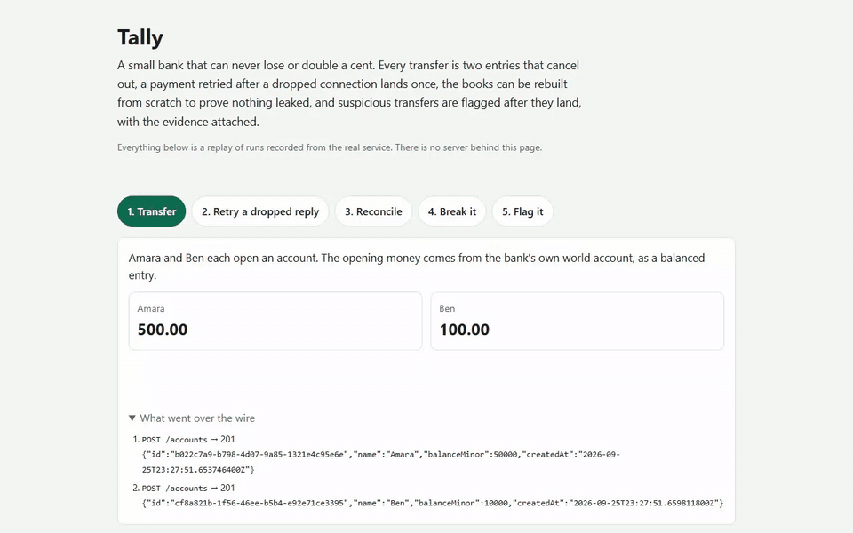
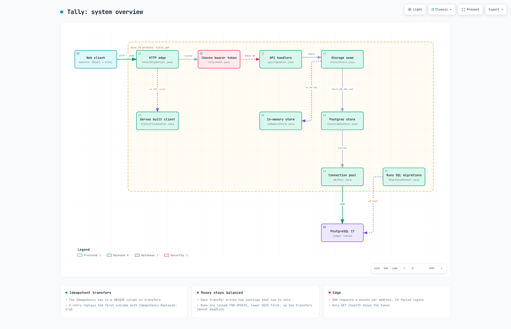
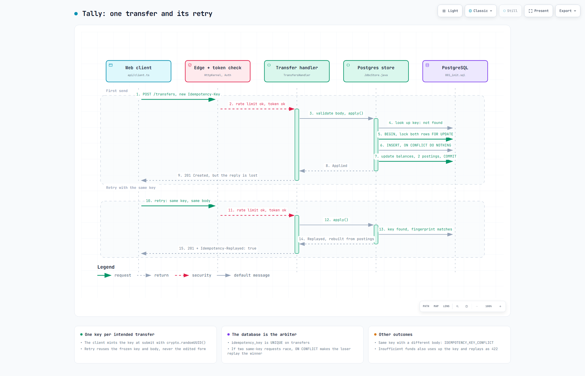
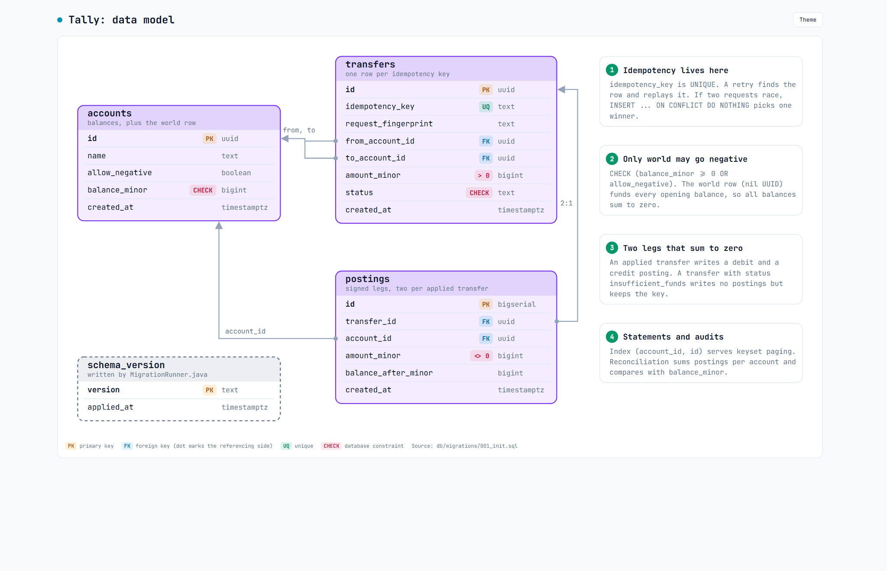
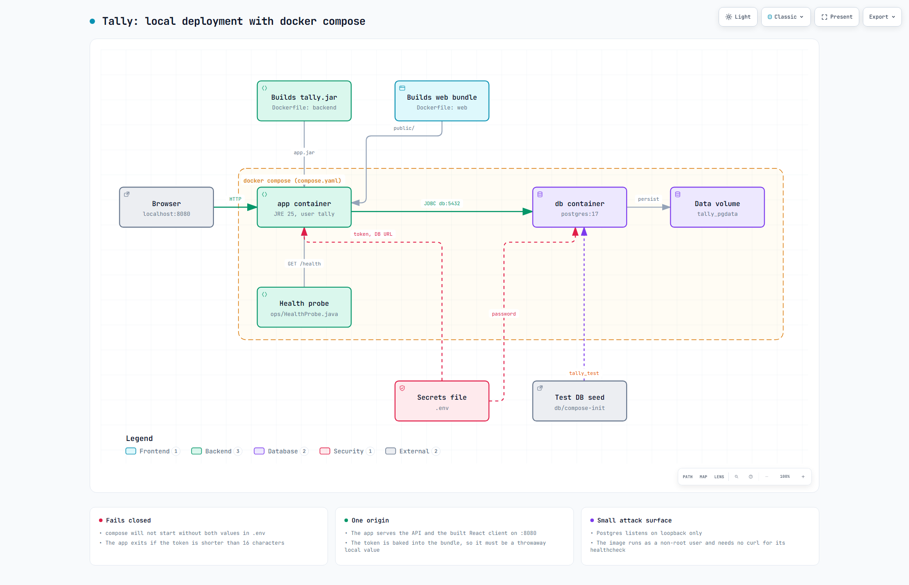

# Tally

Tally is a small banking service built on a double-entry ledger, with a Java backend, a Postgres store, and a React client.



## What it does

Accounts hold balances. A transfer moves money between two accounts by writing two postings, one negative and one positive, that sum to zero. Because every movement is recorded that way, the whole book always nets to zero, and a reconciliation endpoint proves it on demand by re-deriving every balance from the postings. Each account has a paginated statement. Transfers are idempotent: the client sends a unique key with each intended transfer, and if the response is lost, retrying with the same key applies the transfer exactly once. The web client shows all of this, including a fault toggle that drops a response so you can watch the retry get deduplicated. There is also an in-app "Try it" strip that runs these flows for you.

## How it works

A request passes through one HTTP edge that throttles it and checks the token, then a handler, then a store that writes each transfer to Postgres in a single transaction.


The main parts of the Java service, and how the Postgres or in-memory store gets picked at startup.


A transfer is applied once, its reply is lost, and a retry with the same idempotency key gets back the stored result.


The three ledger tables from `db/migrations/001_init.sql`, plus the constraints that back the code's rules.


What `docker compose up --build` builds and runs, and where each secret comes from.

Interactive versions with pan, zoom and theme switch (data-model.html has the theme switch only): `docs/diagrams/overview.html`, `docs/diagrams/main-flow.html`, `docs/diagrams/data-model.html`, `docs/diagrams/deployment.html`


## Design decisions

The reasoning lives in [docs/adr/](docs/adr/), one decision per file. The ones that shape the project:

- **Double-entry postings, with a world account.** Money is never created or destroyed inside the ledger; it only moves. Opening balances are funded by a special world account that is allowed to go negative, so even money entering the system is a balanced entry. ([ADR 0004](docs/adr/0004-a-world-account-funds-openings-and-may-go-negative.md))
- **Money is a `long` in integer minor units.** No floats and no BigDecimal: amounts are counts of cents, added with overflow checks, and the JSON wire format only ever carries integers. ([ADR 0002](docs/adr/0002-money-is-a-long-in-integer-minor-units.md))
- **Idempotent transfers.** The server stores the first outcome for each idempotency key and replays it on any retry, backed by a unique constraint in the database so the guarantee survives restarts. The client mints one key per intended transfer, and a retry reuses the frozen key and body, never the edited form. ([ADR 0006](docs/adr/0006-idempotency-key-replays-first-outcome.md), [ADR 0019](docs/adr/0019-one-key-per-intended-transfer.md))
- **Hand-written JSON and the JDK's built-in HTTP server.** The API surface is small and fixed, so the project parses and writes its JSON by hand and serves HTTP from the standard library on virtual threads, instead of taking on a framework. The choice was revisited after a hardening review and kept deliberately. ([ADR 0008](docs/adr/0008-hand-written-json.md), [ADR 0009](docs/adr/0009-http-jdk-server.md), [ADR 0017](docs/adr/0017-keep-the-hand-written-json.md))
- **Postgres as the store, with the constraints as the last line of defense.** Plain SQL migrations run by a small hand-rolled runner, a fixed-size connection pool, pessimistic row locks at read committed, and stored balances with keyset pagination for statements. The invariants the code enforces are also declared as database constraints, so a bug in one layer is caught by another. ([ADR 0011](docs/adr/0011-pessimistic-row-locks-at-read-committed.md), [ADR 0012](docs/adr/0012-plain-sql-migrations-with-a-hand-rolled-runner.md), [ADR 0013](docs/adr/0013-a-hand-rolled-fixed-size-connection-pool.md), [ADR 0014](docs/adr/0014-stored-balances-and-keyset-pagination.md))
- **A client with two runtime dependencies.** The web app is React, TypeScript, and Vite, and nothing else: no router, no state library, no CSS framework, one hand-written stylesheet. The money, error, and transfer-intent logic are pure modules with their own tests. ([ADR 0018](docs/adr/0018-react-typescript-vite.md))
- **A static bearer token, checked at the edge.** Every endpoint except `/health` requires a token from the environment, reads included. This is still demo-grade auth on purpose, and the ADR names exactly what it does not protect against. ([ADR 0015](docs/adr/0015-a-static-bearer-token-checked-at-the-edge.md))
- **A throttle, browser headers, and signed cursors at the edge.** The kernel rate-limits by client address, with a small separate budget for failed authentication, and answers `429` with `Retry-After`. Every response carries a CSP written against the real Vite build plus the usual hardening headers, statement cursors are HMAC-signed so they cannot be forged, and no credential is a literal anywhere in the repository. ([ADR 0021](docs/adr/0021-rate-limits-security-headers-and-signed-cursors.md))

How the guarantees are tested and where each one is enforced is written up in [docs/correctness.md](docs/correctness.md).

## Running it

The quickest way is Docker, which brings up Postgres and the app (API plus the built web client) on one origin. Both credentials come from a `.env` you create; nothing is hardcoded, and compose refuses to start without them:

```
cp .env.example .env            # then fill in the two values, e.g.
                                #   POSTGRES_PASSWORD=$(openssl rand -base64 24)
                                #   TALLY_API_TOKEN=$(openssl rand -hex 24)
docker compose up --build
```

Then open http://localhost:8080. `TALLY_API_TOKEN` is baked into the served JavaScript so creates and transfers work out of the box, which is exactly why it should be a throwaway local value: anyone who opens the page has it. `.env` is gitignored.

To run the backend by hand you need JDK 25. Maven comes from the wrapper, downloaded and checksum-verified on first use:

```
./mvnw package                # .\mvnw.cmd on Windows
TALLY_API_TOKEN=some-local-token-16ch java -jar target/tally.jar
```

The token is required (startup fails without one of at least 16 characters) and every endpoint but `GET /health` needs it, so a `curl` to the API carries `-H "Authorization: Bearer $TALLY_API_TOKEN"`. `TALLY_DB_URL` points at Postgres; leave it unset and the server runs on an in-memory store, which is enough to try the API. `TALLY_PORT` defaults to 8080.

For the web client in development:

```
cd web
npm install
npm run dev
```

Copy `web/.env.example` to `web/.env.local` and set `VITE_API_TOKEN` to the backend's token. The dev server runs on http://localhost:5173 and proxies API calls to the backend on 8080.

## Tests

```
./mvnw test                     # backend unit tests, no database needed

docker compose up -d db         # needs .env, and publishes only on 127.0.0.1
                                # then the integration suite against real Postgres:
TALLY_TEST_DB_URL="jdbc:postgresql://localhost:5432/tally_test?user=tally&password=$POSTGRES_PASSWORD" ./mvnw -Pintegration verify

cd web
npm test                        # vitest over the pure client modules
npm run typecheck
```

Without `TALLY_TEST_DB_URL` the integration tests skip with instructions rather than fail.

CI runs the same thing on every push: the backend job against a real Postgres service container, and the web job in parallel.

## Layout

- `src/` is the Java backend: the pure ledger domain, the in-memory and Postgres stores, and the HTTP layer.
- `web/` is the React client.
- `db/migrations/` holds the plain SQL schema migrations.
- `docs/` holds the ADRs and the correctness write-up.

## License

MIT, see [LICENSE](LICENSE). The Maven wrapper scripts keep their own Apache-2.0 headers.
